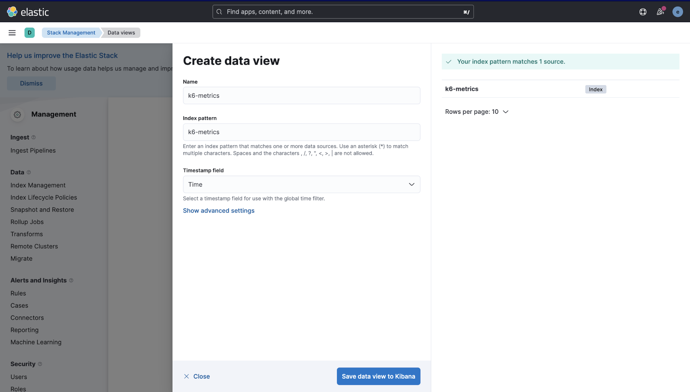
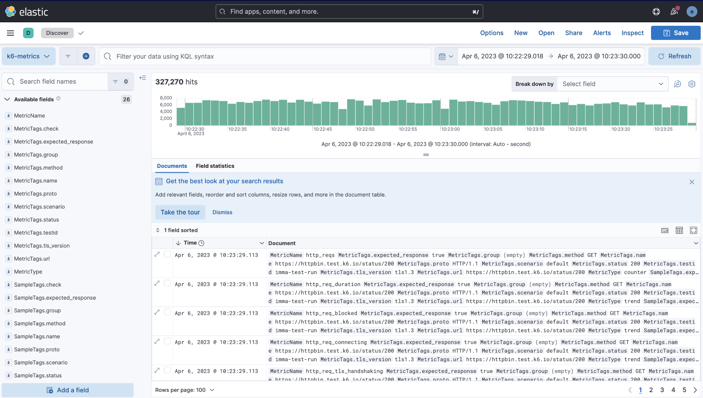

# xk6-output-elasticsearch

[k6 extension](https://k6.io/docs/extensions/) for publishing test-run metrics to Elasticsearch.

## Prerequisites

[Go](https://golang.org/) 1.20 or better (verify with `go version`).

## Install

Install [xk6](https://k6.io/docs/extensions/guides/build-a-k6-binary-using-go/):

```shell
# Install xk6
go install go.k6.io/xk6/cmd/xk6@latest

# Build the xk6 binary locally
git clone git@github.com:elastic/xk6-output-elasticsearch.git
# Build k6 locally with the Elasticsearch output extension
make
```

You will have a `k6` binary in the current directory.

### Using Docker

This [Dockerfile](./Dockerfile) builds a docker image with the k6 binary.

## Configuration

### Running in Production

> [!NOTE]
> The examples below use Elastic Cloud, which allows to connect via `K6_ELASTICSEARCH_CLOUD_ID`. Alternatively you can also specify the connection URL with `K6_ELASTICSEARCH_URL`.

You can run the new k6 binary against a Cloud cluster with:
```shell
export K6_ELASTICSEARCH_CLOUD_ID=your-cloud-id-here
export K6_ELASTICSEARCH_USER=elastic
export K6_ELASTICSEARCH_PASSWORD=your-password-here

./k6 run ./examples/script.js -o output-elasticsearch
```

or alternatively via an [API key](https://www.elastic.co/guide/en/elasticsearch/reference/current/security-api-create-api-key.html) (see also how to [create an API key in Kibana](https://www.elastic.co/guide/en/kibana/current/api-keys.html)):
```shell
export K6_ELASTICSEARCH_CLOUD_ID=your-cloud-id-here
export K6_ELASTICSEARCH_API_KEY=your-base64-encoded-api-key-here

./k6 run ./examples/script.js -o output-elasticsearch
```

or a [service account token](https://www.elastic.co/guide/en/elasticsearch/reference/current/service-accounts.html#service-accounts-tokens):
```shell
export K6_ELASTICSEARCH_CLOUD_ID=your-cloud-id-here
export K6_ELASTICSEARCH_SERVICE_ACCOUNT_TOKEN=your-service-account-token-here

./k6 run ./examples/script.js -o output-elasticsearch
```

or with [client certificate authentication](https://www.elastic.co/guide/en/elasticsearch/reference/current/pki-realm.html)
```shell
export K6_ELASTICSEARCH_CLIENT_CERT_FILE=cert.pem
export K6_ELASTICSEARCH_CLIENT_KEY_FILE=key.pem

./k6 run ./examples/script.js -o output-elasticsearch
```

### Running a local cluster

Alternatively, you can send metrics to a local (unsecured) cluster:

```shell
export K6_ELASTICSEARCH_URL=http://localhost:9200

./k6 run ./examples/script.js -o output-elasticsearch
```

If running locally with TLS (with a self-signed certificate), set `K6_ELASTICSEARCH_INSECURE_SKIP_VERIFY` to `true` (defaults to `false`):

```shell
export K6_ELASTICSEARCH_URL=https://localhost:9200
export K6_ELASTICSEARCH_INSECURE_SKIP_VERIFY=true

./k6 run ./examples/script.js -o output-elasticsearch
```

The metrics are stored in the index `k6-metrics` by default which will be automatically created by this extension. See the [mapping](pkg/esoutput/mapping.json) for details. The index name can be customized with the environment variable `K6_ELASTICSEARCH_INDEX_NAME`.

## Docker Compose

This repo includes a [docker-compose.yml](./docker-compose.yml) file based on the [documentation](https://www.elastic.co/guide/en/elasticsearch/reference/current/docker.html#docker-file), that starts Elasticsearch and Kibana. It also adds a custom build of k6 having the `xk6-output-elasticsearch` extension. This is just a quick way to showcase the usage, not meant for production usage.

Note that some variables (Stack version, elastic and Kibana users' passwords) are defined in the [`.env`](.env) file, where you can change them.

Clone the repo to get started and follow these steps: 

1. Put your `k6` scripts in the `examples` directory or use the [`script.js`](examples/script.js) example.

3. Start the `docker-compose` environment.

	```shell
	docker-compose up -d
	```

4. Use the k6 Docker image to run the k6 script and send metrics to the Elasticsearch cluster started in the previous step.

    ```shell
    docker-compose run --rm -T k6 run -<examples/script.js --tag testid=<SOME-ID>
    ```

	> Note that the [docker-compose command to run k6 tests](https://k6.io/docs/getting-started/running-k6/) might differ depending your OS.

5. Visit http://localhost:5601/ to view results in Kibana (default credentials are `elastic` / `changeme`).

    - Create a [Data View](https://www.elastic.co/guide/en/kibana/current/data-views.html) for the index `k6-metrics` or the index name in `K6_ELASTICSEARCH_INDEX_NAME` if it is set.
        
    - Go to [Discover](https://www.elastic.co/guide/en/kibana/current/discover.html) to start exploring the metrics.
        

When done, to clean up run `docker-compose down -v`.
